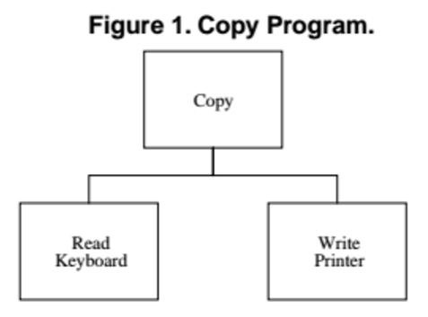

# Kata Formulation: Copy Program

> Consider a simple program that is charged
> with the task of copying characters typed on a keyboard to a printer. Assume, furthermore,
> that the implementation platform does not have an operating system that supports device
> independence. We might conceive of a structure for this:

> 

> Figure [above] is a "structure chart". It shows that there are three modules, or subprograms,
> in the application. The "Copy" module calls the other two. One can easily imagine a loop
> within the "Copy" module. The body of that loop calls the "Read Keyboard" module to fetch 
> a character from the keyboard, it then sends that character to the "Write Printer" module 
> which prints the character.

> extracted from [The Dependency Inversion Principle](https://drive.google.com/file/d/0BwhCYaYDn8EgMjdlMWIzNGUtZTQ0NC00ZjQ5LTkwYzQtZjRhMDRlNTQ3ZGMz/view), by Robert C. Martin

## Problem

Your task, should you accept it, is to write a program that performs the above-descripted
action.

Bear in mind that we are not sure where to 'read' from. Neither where we want to write to.

This is the API we want to have:

```java
class ReadKeyboard {
  public boolean hasNext();
  public String  get();
}
```

```java
class WritePrinter {
  public void print();
}
```

